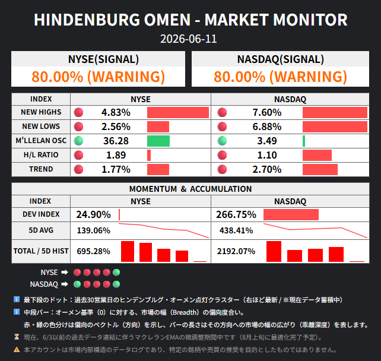

# Market Stress Tracker (MST)

[English](#english) | [日本語](#japanese)

---

<a name="english"></a>
## English

The **Market Stress Tracker (MST)** is an analytical framework designed to continuously monitor underlying structural distortions and systemic stress in the stock market. Deeply inspired by the constituent indicators of the traditional "Hindenburg Omen," MST re-engineers a binary crash-prediction signal into a continuous environmental tracker.



> [!IMPORTANT]
> **Current System Architecture & Roadmap**
> - **Spreadsheet-Based Logic:** All calculations, data aggregation, and dashboard visualizations are currently fully processed and run on **Google Sheets**.
> - **Pipeline Repository:** This repository functions as the data scraping and delivery pipeline. The scraping workflow is triggered programmatically from the Google Sheets side (via Google Apps Script triggers invoking the GitHub API). Once triggered, GitHub Actions runs the scrapers to fetch raw market breadth data and posts it back to the Google Sheets backend via a Google Apps Script (GAS) web app endpoint.
> - **Future Outlook:** There is a plan to migrate this spreadsheet-based logic into a standalone, modern web application in the future.

---

### Core Philosophy

Traditional crash-prediction models like the Hindenburg Omen (HO) operate on a rigid, binary "On/Off" logic. They only trigger when specific thresholds are breached, failing to capture shifting gradations, latent accumulation of risk, and threshold-boundary behaviors. This rigidity often results in false signals (whipsaws) and misses critical pre-crash conditions.

MST addresses these limitations by focusing on **"Deviation Volume" (Depth of Distortion)**. Rather than treating indicators as simple triggers, it measures how deeply they deviate from their baseline (Zero-Point). 

#### Shifting the Meaning of Colors (Red & Green)
In the MST dashboard, "Red" and "Green" do not represent simple "Danger" versus "Safety." Both directions indicate significant systemic deviation.
* **Red (Omenside Deviation):** Shows that traditional HO criteria are accumulating, representing expanding structural distortion in the negative direction.
* **Green (Reverse-side Deviation):** Shows that while HO criteria are absent, the market is exhibiting an abnormal structural bias in the opposite direction.

For a comprehensive breakdown of the core theory, please read the full [Philosophy and Design Specification (English)](docs/philosophy-en.md).

---

### Parameter & State Definitions

| Metric | Baseline | Red Deviation (Omenside) | Green Deviation (Reverse-side) |
| :--- | :---: | :--- | :--- |
| **NEW HIGHS** | 2.2% | **High-side Imbalance:** Expanding new highs amidst surface-level market advances. | **Momentum Atrophy:** Loss of upward driving force; inability to bid up new highs. |
| **NEW LOWS** | 2.2% | **Low-side Imbalance:** Underlying decay and internal fragmentation beneath a rising surface. | **Momentum Atrophy:** Total stagnation; lack of downward liquidity to print new lows. |
| **M'LLELAN OSC** | 0 | **Liquidity Outflow:** Rapid retreat of short-term buying demand and deep selling pressure. | **Short-term Overheating:** Speculative reflexive rebounds or localized capital concentration. |
| **H/L RATIO** | 2.0 | **New Low Dominance:** Accelerating downward internal market vectors. | **New High Dominance:** Extreme one-sided market crowding or localized overheating. |
| **TREND** | 0% | **Upward Divergence:** Current price structure is abnormally overextended above the 50-day SMA. | **Downward Anchored:** Price structure is structurally locked into a lower vector below the 50-day SMA. |

---

### Data Pipeline & Setup

This repository coordinates the automated ingestion and transmission of market breadth metrics (NYSE, NASDAQ, and JPX).

```
[GAS Trigger (Google Sheets)] ──(Workflow Dispatch API)──> [GitHub Actions]
                                                                 │
                                                          (Executes scripts)
                                                                 │
                                                                 ▼
[Google Sheets Dashboard] <──(POST JSON Data)── [Node.js Scrapers] <──(Scrapes)── [Target Markets]
```

<details>
<summary><b>View Integration & Setup Guide</b></summary>

#### 1. Google Sheets & Apps Script Setup
1. Create a Google Spreadsheet and open **Extensions > Apps Script**.
2. Paste the contents of `gas_endpoint.js` into the editor.
3. Run the `setup` function to generate the necessary sheets and authorize permissions.
4. Click **Deploy > New deployment**, select **Web app**, execute as **Me**, and grant access to **Anyone**. Copy the generated **Web App URL**.

#### 2. GitHub Secrets Configuration
In your GitHub repository, navigate to **Settings > Secrets and variables > Actions** and add a new repository secret:
* **Name:** `GAS_WEBAPP_URL`
* **Value:** *Your copied Web App URL*

#### 3. Local Verification
To test the scrapers locally:
```bash
npm install
$env:GAS_WEBAPP_URL="<Your GAS Web App URL>"
node scrape_jpx.js
node scrape.js
```
</details>

---

### License

This project's code, philosophy, and architectural definitions are licensed under the Creative Commons Attribution-NonCommercial-ShareAlike 4.0 International License (**CC BY-NC-SA 4.0**).
* **Personal & Non-Commercial Use:** Free to share, fork, and adapt, provided appropriate attribution is given.
* **Commercial Use:** Please contact the author or open an issue for licensing inquiries prior to integrating this logic into commercial services or media.
See the [LICENSE](LICENSE) file for the full legal text.

---
---

<a name="japanese"></a>
## 日本語

**Market Stress Tracker (MST)** は、株式市場内部の構造的な歪みやストレス状態を継続的に観察・評価するために設計された分析フレームワークです。伝統的な「ヒンデンブルグ・オーメン」の構成指標から着想を得ており、単なる「暴落シグナル（点灯／消灯）」を一歩進め、連続的な環境認識トラッカーへと再構築しました。


> [!IMPORTANT]
> **現在のシステム構成とロードマップ**
> - **スプレッドシート上での完結:** 現在、すべての計算、データ集計、およびダッシュボード表示は **Google スプレッドシート** 上で処理されています。
> - **パイプラインとしての本リポジトリ:** 本リポジトリは、市場データのスクレイピングおよびデータ引き渡しのパイプラインとして機能しています。スプレッドシート側（GASのトリガー等）からGitHub Actionsの API（Workflow Dispatch）を呼び出してワークフローを起動し、起動されたワークフローがスクレイピングを実行後、データをGASウェブアプリ経由でスプレッドシートに書き戻す双方向の設計になっています。
> - **今後の展望:** 将来的に、現在のスプレッドシートベースのロジックをスタンドアロンのWebアプリケーションとして移行・構築することを計画しています。

---

### 基本設計思想

ヒンデンブルグ・オーメン（HO）をはじめとする従来の暴落予測シグナルは、条件を満たしたか否かを「1か0か」の二分法で判定します。そのため、境界線付近での潜伏的なリスクの蓄積や階調の変化を捉えられず、しばしば「ダマシ（往復ビンタ）」を発生させる原因となっていました。

MSTは、指標が基準値（ゼロポイント）からどれだけ乖離しているかという **「偏位量（歪みの深度）」** に着眼し、これを可視化します。

#### 色彩（赤・緑）が表す真の意味
ダッシュボード上の「赤」と「緑」は、単純な「危険」対「安全」を意味するものではありません。どちらも市場構造に大きな歪みが生じている状態を示します。
* **赤（オーメン方向への偏位）:** 伝統的なHOの点灯条件が蓄積し、下方向への構造的歪みが深刻化していることを示します。
* **緑（逆方向への偏位）:** HO条件からは外れているものの、逆のベクトル（上方向への局所的な偏りなど）へ市場が異常に偏向していることを示します。

理論および設計の詳細は、[Philosophy and Design Specification (日本語)](docs/philosophy-ja.md) をご覧ください。

---

### 構成要素とState（偏位）の定義

| 指標 | 基準値 | 赤の偏位 (オーメン方向) | 緑の偏位 (逆方向) |
| :--- | :---: | :--- | :--- |
| **NEW HIGHS** | 2.2% | **高値不均衡:** 市場表面の上昇に伴い、新高値銘柄が基準値を超えて急増している状態。 | **推進力喪失:** 上方向への買い上がりエネルギーが低下し、新高値更新が衰退している状態。 |
| **NEW LOWS** | 2.2% | **安値不均衡:** 市場表面の堅調さの裏で、新安値銘柄が増加し、内部崩壊が進行している状態。 | **推進力喪失:** 下落流動性すら途絶え、市場が完全に流動性停滞に陥っている状態。 |
| **M'LLELAN OSC** | 0 | **流動性流出:** 短期的な買い需要が急速に後退し、強い売り圧力が生じている状態。 | **短期過熱:** 一時的な自律反発や、局所的な資金集中によって上方に歪んでいる状態。 |
| **H/L RATIO** | 2.0 | **新安値優勢:** 分母（新安値）が優勢となり、市場内部で下方向へのベクトルが進行している状態。 | **新高値優勢:** 分子（新高値）が優勢となり、過度な一極集中や過熱が進行している状態。 |
| **TREND** | 0% | **上方乖離:** 指数現在値が50日移動平均線（SMA）から上方向へ異常に変形・乖離している状態。 | **下方定着:** 指数が50日SMAを大きく下回り、下方向へ構造的に固定化されている状態。 |

---

### データパイプラインとセットアップ

本リポジトリは、NYSE、NASDAQ、JPX市場から指標を自動収集し、スプレッドシートへ送信するパイプラインを提供します。

```
[GAS トリガー (スプレッドシート)] ──(Workflow Dispatch API)──> [GitHub Actions]
                                                                     │
                                                               (スクリプト実行)
                                                                     │
                                                                     ▼
[スプレッドシートダッシュボード] <──(JSONデータをPOST)── [Node.js スクレイパー] <──(情報取得)── [対象市場]
```

<details>
<summary><b>インテグレーション・セットアップ手順を表示</b></summary>

#### 1. Google スプレッドシートおよび GAS の設定
1. 同期先のスプレッドシートを作成し、メニューの **「拡張機能」>「Apps Script」** を開きます。
2. エディタ内の既存コードを削除し、`gas_endpoint.js` の内容を貼り付けます。
3. エディタ上で `setup` 関数を選択して実行し、アクセスの承認を行います（必要なシートが自動生成されます）。
4. 画面右上の **「デプロイ」>「新しいデプロイ」** をクリックし、**「ウェブアプリ」**、実行ユーザーを**「自分」**、アクセス範囲を**「全員」**に設定してデプロイします。発行された **「ウェブアプリのURL」** をコピーします。

#### 2. GitHub Secrets の設定
GitHub リポジトリの **Settings > Secrets and variables > Actions** に移動し、以下のシークレットを登録します。
* **Name:** `GAS_WEBAPP_URL`
* **Value:** *コピーした「ウェブアプリのURL」*

#### 3. ローカル環境での動作テスト
ローカル環境で動作確認を行う場合は、以下のコマンドを実行します。
```bash
npm install
$env:GAS_WEBAPP_URL="<コピーしたGASのウェブアプリURL>"
node scrape_jpx.js
node scrape.js
```
</details>

---

### ライセンス

本プロジェクトのコード、フィロソフィー、および各種設計定義は、クリエイティブ・コモンズ 表示 - 非営利 - 継承 4.0 国際 ライセンス (**CC BY-NC-SA 4.0**) のもとで提供されています。
* **個人利用・非営利目的:** クレジット表記（適切な帰属表示）を行うことを条件に、自由にシェア、フォーク、改変が可能です。
* **商用利用:** 本モデルのロジックやMSTの定義を有料サービスや商業メディア等に組み込む場合は、事前にIssueまたはメール等で利用申請・ご相談ください。
詳細は [LICENSE](LICENSE) ファイルをご参照ください。
